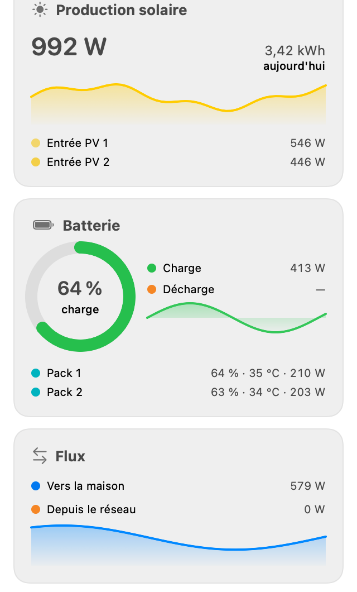
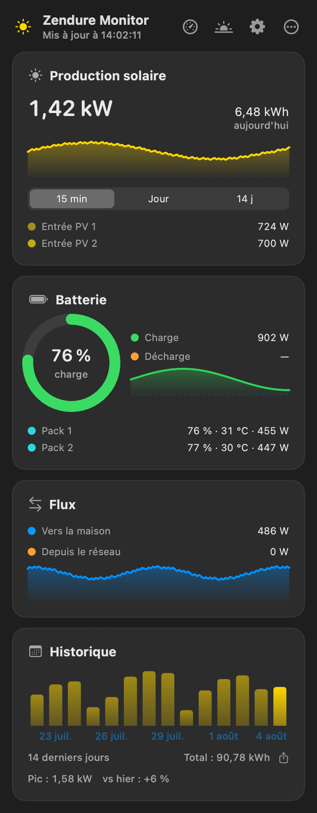
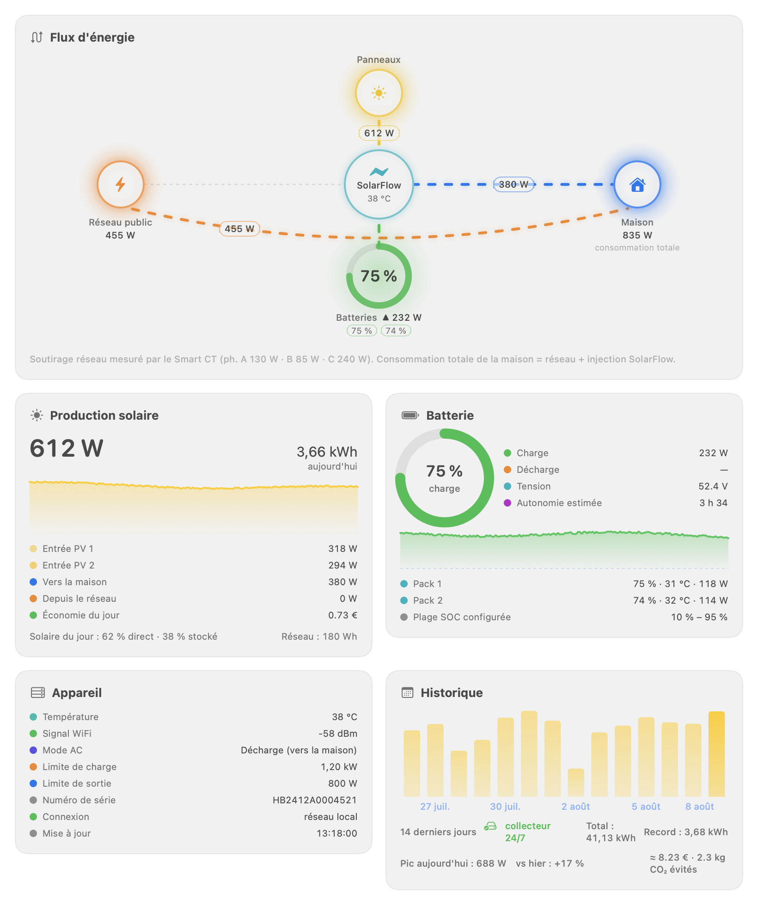

# Zendure Monitor

[](https://github.com/vincentlauriat/ZendureMonitor/releases)


A tiny macOS menu bar app that shows the **live solar production of a Zendure SolarFlow battery** — 100% local, no Zendure cloud account, no MQTT broker, no credentials.

```
☀️ 842 W          ← in your menu bar, refreshed every 5 s
```

Click the icon for the details: battery state of charge, charge/discharge power, per-pack SOC/temperature, output to home, grid input, per-MPPT PV input, and today's solar energy.

New in 1.7: a **large widget** (the 14-day production histogram right on your desktop), **local weather in the Sun window** (Open-Meteo cloud cover and sunshine forecast, with a cloud-adjusted production estimate using the Kasten–Czeplak model), and a **redesigned Sun window** — hero chart plus three compact columns (ephemeris, weather, yield), no scrolling.

In 1.6: **daily solar split** — how much of today's production went straight to the home vs into the battery (AC charging deducted), plus the grid total, shown in both the panel and the dashboard; offline resilience (the panel keeps the last values, dimmed with their age, instead of going blank), a smarter VPN fallback (no more 5 s primary-host timeout on every poll when away), and day counters that roll over at local midnight.

In 1.5: a redesigned panel (header with icon actions, period selector 15 min / day / 14 days, peak & vs-yesterday stats), a **hub-centric energy-flow diagram** (SolarFlow at the center; panels, batteries, public grid, home and the off-grid outlet as peripherals — links animate only when energy actually flows, with live wattage), a dedicated **Sun window** (local NOAA ephemerides, sun path overlaid with today's production, clear-sky theoretical output), **savings estimates** (configurable €/kWh and g CO₂/kWh), extra opt-in notifications (battery full, unexpected grid draw, production record), an upfront **permissions check** (local network / location / notifications), unit tests and a GitHub Actions CI.

New in 1.4: a **dashboard window** and an optional **24/7 collector** (`Scripts/collector/`) for an always-on Mac, so daily history no longer depends on this Mac's uptime.

New in 1.3: a **macOS widget** (small/medium), a **battery control tab** (AC mode, output/charge limits via `POST /properties/write`) and **CSV export** of the production history.

Options: choose what the menu bar shows (solar W, battery %, home W — or icon only), launch at login, low-battery notification with a configurable threshold, theme override (auto/dark/light), and an optional fallback host for remote access over a VPN. UI localized in **French and English**.

## Screenshots

| Light | Dark |
|:---:|:---:|
|  |  |

**Dashboard window** — hub-centric animated energy-flow diagram and every indicator the local API exposes:



**Sun window** — local ephemerides (NOAA algorithm, nothing leaves the Mac), the sun's path overlaid with today's production, a clear-sky theoretical output estimate and the local weather (Open-Meteo) with a cloud-adjusted forecast:


## Supported hardware

Tested on a **SolarFlow 2400 Pro**. Any Zendure device that ships the local zenSDK REST API should work: SolarFlow 2400 AC / AC+ / AC Pro, 800 (Pro/Plus), 1600 AC+, 3000 Mix AC+, 4000 Mix.

## Install

1. Download the latest `ZendureMonitor-x.y.z.dmg` from [Releases](https://github.com/vincentlauriat/ZendureMonitor/releases) (signed & notarized).
2. Drag **ZendureMonitor.app** to `/Applications` and launch it.
3. Accept the **local network** permission prompt (required to reach the battery).
4. Click the ☀️ icon → *Réglages…* → *Rechercher sur le réseau* (or type the device IP) → *Tester la connexion*.

Updates are delivered in-app via [Sparkle](https://sparkle-project.org).

> **If discovery finds nothing:** the local API may be disabled on your unit. In the Zendure mobile app, add a **HEMS** integration and then quit it — this is the documented way to persistently enable the local API.

## Documentation

- **[User guide — Français](docs/guide/fr/)** · **[English](docs/guide/en/)** — installation, first setup, every window explained, widgets, battery control, remote access, FAQ & troubleshooting ([index](docs/guide/README.md))
- **[Project wiki](https://github.com/vincentlauriat/ZendureMonitor/wiki)** — same guide, browsable online
- **[Landing page](https://vincentlauriat.github.io/ZendureMonitor/)** — overview with screenshots

## How it works — the full technical story

### 1. The local zenSDK API

Recent Zendure firmwares embed a plain HTTP server on **port 80** of the device (official docs: [Zendure/zenSDK](https://github.com/Zendure/zenSDK)). No authentication is required on the local network for reads. The app polls a single endpoint:

```
GET http://<device>/properties/report
```

which returns everything in one JSON document:

```json
{
  "timestamp": 1785801130,
  "sn": "EEB4AEXXXXXXXXX",
  "product": "solarFlow2400Pro",
  "properties": {
    "solarInputPower": 842,      // total PV input (W)
    "solarPower1": 420,          // per-MPPT input, channels 1…6 (W)
    "solarPower2": 422,
    "electricLevel": 76,         // average state of charge (%)
    "outputHomePower": 410,      // AC output to the home (W)
    "gridInputPower": 0,         // AC drawn from the grid (W)
    "packInputPower": 0,         // battery discharge (W)
    "outputPackPower": 432,      // battery charge (W)
    "acMode": 2, "inverseMaxPower": 1500, "...": "…"
  },
  "packData": [
    { "sn": "…", "socLevel": 76, "maxTemp": 3081, "totalVol": 4840, "power": 0 }
  ]
}
```

Field reference: [zenSDK `en_properties.md`](https://github.com/Zendure/zenSDK/blob/main/docs/en_properties.md). The parser (`Sources/DeviceState.swift`) is deliberately tolerant: it accepts the payload with or without the `properties` nesting (older firmwares return it flat) and numbers as Int, Double or String.

Writing is possible too (`POST /properties/write` with `{"sn": …, "properties": {"acMode": 2}}`) but this app is strictly **read-only**.

### 2. Device discovery — a firmware quirk worth knowing

The zenSDK docs say devices advertise over mDNS/Bonjour as **`_zendure._tcp`**. In practice, a SolarFlow 2400 Pro (firmware as of mid-2026) advertises under the generic **`_http._tcp`** type instead, with an instance name of:

```
Zendure-<product>-<serialNumber>     e.g. Zendure-solarFlow2400Pro-EEB4AEXXXXXXXXX
```

resolving to `Zendure-<product>-<serial>.local:80`. The app therefore browses **both** service types and keeps `_http._tcp` results only when the instance name starts with `Zendure` (`Sources/Discovery.swift`). You can verify from a terminal:

```bash
dns-sd -B _http._tcp local.        # look for a Zendure-* instance
curl http://Zendure-<…>.local/properties/report | jq .properties.solarInputPower
```

### 3. App architecture

Pure Swift / SwiftUI, no third-party dependency besides Sparkle. Generated with [XcodeGen](https://github.com/yonaskolb/XcodeGen) from `project.yml`.

```
Sources/
  ZendureMonitorApp.swift   @main — MenuBarExtra (LSUIElement agent app), Settings scene,
                            dashboard & Sun windows, shared Dock activation policy
  Components/               reusable card/gauge/sparkline views (Swift Charts), the energy-flow
                            diagram and the Sun card — shared design language with MacInside
  Monitor.swift             @MainActor ObservableObject: async polling loop (2–60 s, URLSession,
                            5 s timeout), daily curve/peak persistence, savings, notifications
  DeviceState.swift         zenSDK payload model + tolerant JSONSerialization parser
  Discovery.swift           Bonjour browser (_zendure._tcp + _http._tcp) resolving hostnames
  MenuView.swift            dropdown panel (header with icon actions, cards, period selector)
  DashboardView.swift       dashboard window (flow diagram + full indicator cards)
  SunView.swift             Sun window (ephemerides, sun path × production, theoretical output)
  SettingsView.swift        tabs: device, display, sun, notifications, control, remote, general
  LocationFetcher.swift     one-shot CoreLocation fix to prefill the sun position
  PermissionsStatus.swift   upfront permissions check (local network, location, notifications)
  Shared/                   Format, SunCalc (NOAA), widget snapshot — also compiled into tests
  Updater.swift             Sparkle SPUStandardUpdaterController wiring
Tests/                      unit tests (parser, SunCalc, Format) — run in CI on every PR
```

Design choices:

- **`MenuBarExtra` with `.window` style** — the label is plain `Text` with an interpolated SF Symbol, so the menu bar shows live wattage (`☀️ 842 W`, `— W` when unconfigured).
- **Polling, not push.** The device has no local push channel; a 5 s `GET` of a ~2 KB JSON is negligible for both sides. The loop is a cancellable `Task` that restarts when host or interval changes.
- **Stale-data policy:** on errors the last reading stays visible (with a warning row) for 60 s, then the display falls back to "no data" — avoids flapping on a single missed poll.
- **Privacy/entitlements:** `NSLocalNetworkUsageDescription` + `NSBonjourServices` (macOS local-network privacy), `NSAllowsLocalNetworking` for cleartext HTTP to `.local` hosts. IP literals are ATS-exempt.

### 4. Release & auto-update pipeline

`Scripts/release.sh <version>` produces a distributable DMG:

1. `xcodegen generate` + `xcodebuild -configuration Release` (unsigned — signing is done manually because post-build `com.apple.provenance` xattrs break `codesign --force` in place).
2. Stage with `ditto --norsrc --noextattr --noacl`, then **Developer ID** sign deepest-first (Sparkle's `Autoupdate`, XPC services, `Updater.app`, the framework, then the app) with Hardened Runtime + secure timestamp (with retries — Apple's timestamp server is flaky).
3. `hdiutil` DMG (app + `/Applications` alias), **notarized** with `notarytool` and **stapled**.
4. The DMG is EdDSA-signed with Sparkle's `sign_update`; `appcast.xml` (served from this repo's `main` branch, referenced by `SUFeedURL`) points to the GitHub release asset, so installed apps self-update.

Independent verification after each release:

```bash
spctl -a -t exec -vv ZendureMonitor.app   # accepted, source=Notarized Developer ID
xcrun stapler validate ZendureMonitor-<v>.dmg
codesign --verify --deep --strict ZendureMonitor.app
```

## Remote access (away from home)

The zenSDK API only exists on your LAN, and it has **no authentication** — so **never port-forward the device's port 80 to the internet**. The safe pattern is a VPN into your home network:

1. Run [Tailscale](https://tailscale.com) (or WireGuard) on a machine that stays home (a Mac, a NAS, a Raspberry Pi, a router) and enable **subnet routing** for your LAN (e.g. `192.168.68.0/24`), or use the Zendure's IP through the tunnel.
2. Install Tailscale on your Mac; when away, the SolarFlow's LAN IP stays reachable through the tunnel.
3. In Zendure Monitor → *Réglages* → *Accès distant*, set the reachable address as **fallback host**. The app polls the primary (local) address first and switches to the fallback automatically when the primary doesn't answer.

Alternative for Home Assistant users: keep HA as the single LAN client of the device (e.g. [Zendure-HA-zenSDK](https://github.com/Gielz1986/Zendure-HA-zenSDK)) and access HA remotely; this app remains the local, zero-dependency companion.

## Build from source

```bash
brew install xcodegen
git clone https://github.com/vincentlauriat/ZendureMonitor.git && cd ZendureMonitor
xcodegen generate
xcodebuild -project ZendureMonitor.xcodeproj -scheme ZendureMonitor \
  -configuration Debug build CODE_SIGNING_ALLOWED=NO -derivedDataPath build
codesign --force --deep -s - build/Build/Products/Debug/ZendureMonitor.app
open build/Build/Products/Debug/ZendureMonitor.app
```

## Roadmap

- [x] v1.0 — live production in the menu bar, local zenSDK polling, Bonjour discovery, Sparkle auto-update
- [x] v1.1 — trend graphs: metric cards with sparklines (solar, home, battery flow) and a battery ring gauge
- [x] v1.2 — menu bar display options, launch at login, low-battery alert, today's energy counter, per-pack details, VPN fallback host
- [x] v1.3 — macOS widget (App Group snapshot), battery control tab (`POST /properties/write`), CSV export of the history
- [x] v1.4 — dashboard window with animated energy-flow diagram; optional 24/7 collector (LaunchAgent + SQLite + JSON API) feeding complete history
- [x] v1.2 — multi-day production history (daily kWh bar chart)
- [x] v1.5 — hub-centric flow diagram (batteries, grid, home, off-grid outlet as peripherals), Sun window (local ephemerides + production overlay + theoretical output), Juicy-style panel with period selector and stats, savings estimates (€/CO₂), extra opt-in notifications, permissions check, unit tests + GitHub Actions CI
- [x] v1.6 — daily solar split (direct/stored + grid total) in panel & dashboard, offline resilience (stale values kept & dimmed), sticky VPN fallback, local-midnight day rollover, colored header actions, EnergyMath unit tests
- [x] v1.7 — large widget (14-day histogram), weather in the Sun window (Open-Meteo, cloud-adjusted forecast), redesigned Sun window, extracted & tested DailyAccumulator
- [ ] v1.8 — Chinese localization, reorderable cards, widget refresh button (AppIntents)
- [ ] v2.0 — off-peak/peak-hours optimizer (local scheduler via `POST /properties/write`)

## Acknowledgements

- [Zendure/zenSDK](https://github.com/Zendure/zenSDK) — official local API documentation
- [Gielz1986/Zendure-HA-zenSDK](https://github.com/Gielz1986/Zendure-HA-zenSDK) — Home Assistant integration that proved the local-first approach
- [Sparkle](https://sparkle-project.org) — macOS app update framework

## License

MIT — see [LICENSE](LICENSE).
