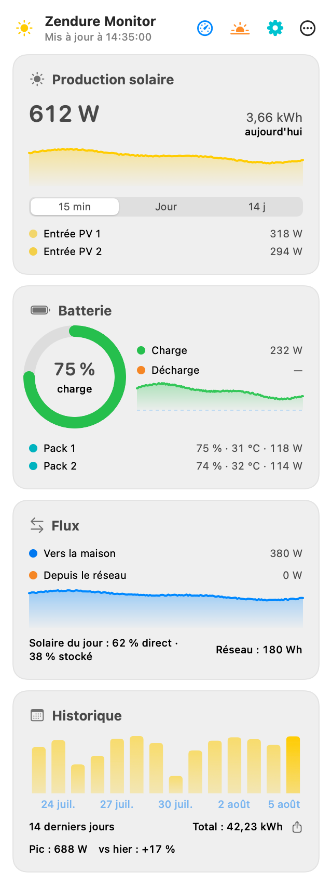
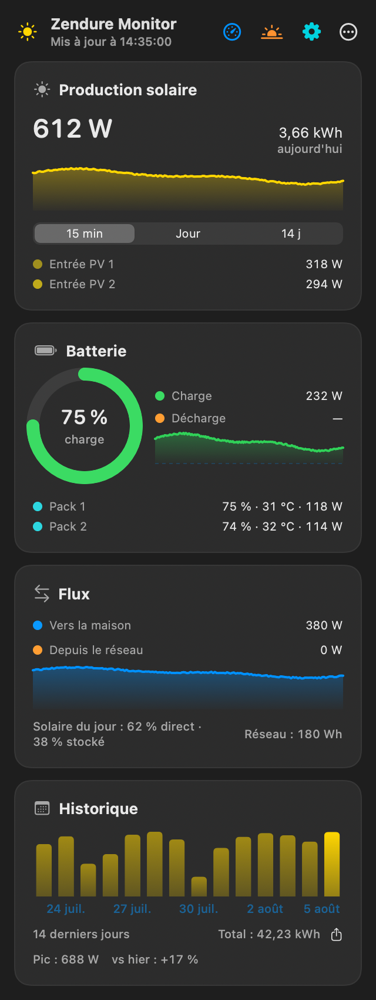

[🇫🇷 Version française](../fr/panneau.md)

# The menu bar panel

Click the ☀️ icon to open the panel: five cards that sum everything up at a glance.

Since 1.11, every card **collapses with a click on its header** (chevron on the right): collapsed, it keeps a single line with its key value — production in W, battery in %, home flow in W, total consumption in W, 14-day total in kWh. The state is remembered per card. And each card can be **hidden entirely** in *Settings → Display → Panel cards*.

*The panel in light theme: production, battery, flows and history.*

*The same panel in dark theme.*

## The header

At the top of the panel: the app name, the time of the last update, and five icon actions:

- **Blue gauge** — opens the [dashboard](dashboard.md);
- **Orange sun** — opens the [Sun window](sun.md);
- **Purple clock** — opens the [History window](history.md) *(1.12)*;
- **Teal gear** — opens Settings;
- **⋯** — a menu with **Check for updates…** and **Quit Zendure Monitor**.

Tip: **double-clicking any chart** in the panel opens the dashboard.

## Solar production card

- The **instantaneous power** in large type, and **today's energy** (kWh) on the right.
- A chart whose period is picked with the **15 min / Day / 14 d** selector:
  - **15 min** — sparkline of the latest readings;
  - **Day** — today's production curve (the maximum of each 5-minute slice, kept across app restarts);
  - **14 d** — histogram of the last 14 days' energy.
- If the battery has several MPPT inputs, each **PV input** is listed with its power.

## Battery card

- A **circular gauge** of the state of charge (SOC), with "charging" or "discharging" in the center when a flow is active. The color follows the level: red below 15%, orange below 40%, green above.
- **Charge** and **Discharge** rows with the flow power, and a sparkline of the battery flow (green when charging, orange when discharging).
- One row per physical **pack**: SOC, temperature and power.

## Flows card

- **To the home** — the power delivered to your installation.
- **From the grid** — the power drawn from the public grid.
- A sparkline of the power sent to the home.
- **Today's solar split**: "X% direct · Y% stored" — the share of today's production that went straight to the home versus into the battery (AC charging from the grid, e.g. during off-peak hours, is deducted from the calculation). Today's cumulated **grid** energy shows on the right once it is significant.

## Home consumption card

*New in 1.10.3.*

- With a [Smart CT meter](cloud.md#the-smart-ct-meter) configured: the home's **total consumption** in large type — the grid draw measured at the electrical panel (the SolarFlow's own AC charging, which the meter also sees, is deducted) plus the SolarFlow's output — with a per-source breakdown: **From the SolarFlow** and **From the grid**.
- Without a meter: only the SolarFlow output is shown ("via SolarFlow only"), with an invitation to set up the Smart CT.
- If the meter is configured but **unreachable** (typically away from home: it is only readable on the local network), the card says so explicitly — the value is marked partial rather than suggesting no meter exists.

## History card

- The histogram of the **last 14 days** with the period total.
- The share button exports the whole stored history (up to 90 days) as **CSV** (columns `date,wh`).
- Below: today's power **peak** and the **vs yesterday** comparison in percent.

## Offline: the values stay on screen

If the battery stops answering (network outage, device off), the panel does not go blank: the last values stay visible, **dimmed**, and the header reads "Offline — last data at HH:MM:SS". Warning banners appear at the bottom of the panel as needed: connected via the fallback host, network error, local network access blocked, notifications denied.

## Menu bar options

In **Settings → Display**, choose what the menu bar shows next to the icon:

- **Solar production (W)** — on by default;
- **Battery level (%)**;
- **Home consumption (W)**.

Unchecking everything shows only the ☀️ icon. The same tab offers the **Panel cards** section (show or hide each of the five cards) and the **theme**: Auto (follows macOS), Dark or Light.

---

[← Getting started](getting-started.md) | [Index](../README.md) | [The dashboard →](dashboard.md)
