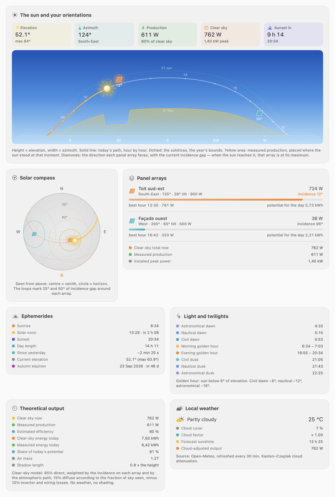
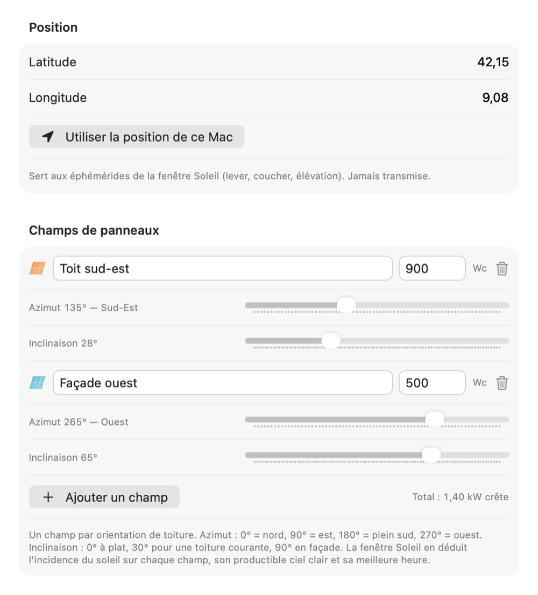

[🇫🇷 Version française](../fr/soleil.md)

# The Sun window

Open it from the **orange sun** icon in the panel header. It gathers the sun's real path, the orientation of each of your panel arrays, today's production, the ephemerides, the light, the theoretical output and the local weather.

*The Sun window: the sky dome as hero, then the solar compass, the per-array detail, the ephemerides, the light, the yield and the weather.*

## Setting your position

The window needs your latitude and longitude: **Settings → Sun**, **Position** section. Two ways to fill them in:

- type the values manually;
- click the button that uses the **Mac's location** (a one-shot CoreLocation fix, with macOS's consent).

*The Sun tab: position, then one panel array per orientation.*

The ephemerides are computed **locally on the Mac** (NOAA algorithm): your position never leaves the machine for that calculation. One exception: when the weather card is in use, the coordinates (rounded to 4 decimal places) are sent to the Open-Meteo service to fetch the forecast.

## Describing your panel arrays

In **Settings → Sun**, **Panel arrays** section, add one array per roof orientation. For each of them:

- a free-form **name** ("South-east roof", "West wall"…);
- the **peak power** in Wp;
- the **azimuth**: 0° = north, 90° = east, 180° = due south, 270° = west — the slider shows the matching compass label;
- the **tilt**: 0° flat, 30° for a typical roof, 90° for a wall.

If you had only entered a peak power in an earlier version, it is carried over as a single array facing due south at a 30° tilt: nothing to retype, but do adjust the orientation so the estimates match your actual installation.

## The hero: the sky dome

The top chart is a map of the sky. **Height** is the sun's elevation, **width** its azimuth (the E, SE, S, SW, W marks sit on the horizon):

- the **solid line** is the sun's path today, with one dot per hour; the part already travelled is bright, the rest of the day dimmed;
- the **dotted lines** are the two solstice paths — the bounds the sun never crosses at your location;
- the **yellow area** is today's measured production, placed at the spot in the sky where the sun stood at that moment;
- the **coloured diamonds** are the directions your arrays face, with the current incidence gap. When the sun reaches a diamond, that array is working at its maximum and its marker lights up;
- the **sky** shifts colour with the sun's height: starry night, twilight, golden hour, broad daylight.

## The solar compass

The same sky, seen from above: the **centre is the zenith**, the **outer circle the horizon**, north up. It shows today's path and the solstice paths, and above all, around the direction each array faces, the **25° and 50° iso-incidence loops**: the patch of sky in which that array produces near its optimum. The sun travels across them through the day.

## Panel arrays

One row per array, in its colour:

- the array's **clear-sky output** right now;
- the sun's **incidence** on that array, in degrees (0° = straight on);
- a **bar** showing the share of peak irradiance actually captured;
- the array's **best hour** of the day, and its **potential for the day** in kWh.

At the foot of the card: the clear-sky total, the measured production and the installed peak power.

## Ephemerides

Sunrise, sunset, **solar noon** (with the time left), day length, the **change in day length since yesterday** down to the second, current and maximum elevation, and the **next solstice or equinox** with its countdown.

## Light and twilights

The civil (−6°), nautical (−12°) and astronomical (−18°) **dawns** and **dusks**, and the two **golden hours** — the stretches when the sun sits below 6° of elevation.

## Theoretical output

- **Clear sky now** — the sum of the output of all your arrays;
- **Measured production** and **estimated yield**;
- **Clear-sky energy for the day** against **measured energy for the day**, and the **share of the potential** reached;
- the **air mass** crossed and the **shadow length** of a one-unit-tall object.

The model: 85% direct radiation, weighted by the incidence on each array and by the atmospheric path (Meinel's law), 15% diffuse according to the fraction of sky the panel sees, minus 10% inverter and wiring losses. It knows nothing about the weather or your shading.

## Local weather

The weather comes from **Open-Meteo** (a free service, no account, no API key), refreshed at most every 30 minutes:

- current conditions (clear sky, cloudy, rain…) and temperature;
- **cloud cover** in percent and the **cloud factor** applied;
- today's forecast **sunshine duration**;
- **cloud-adjusted output** — the clear-sky theoretical attenuated by cloud cover (Kasten–Czeplak formula: factor 1 − 0.75 × C^3.4, i.e. at least 25% of the theoretical under a fully overcast sky).

---

[← The dashboard](dashboard.md) | [Index](../README.md) | [Widgets →](widgets.md)
