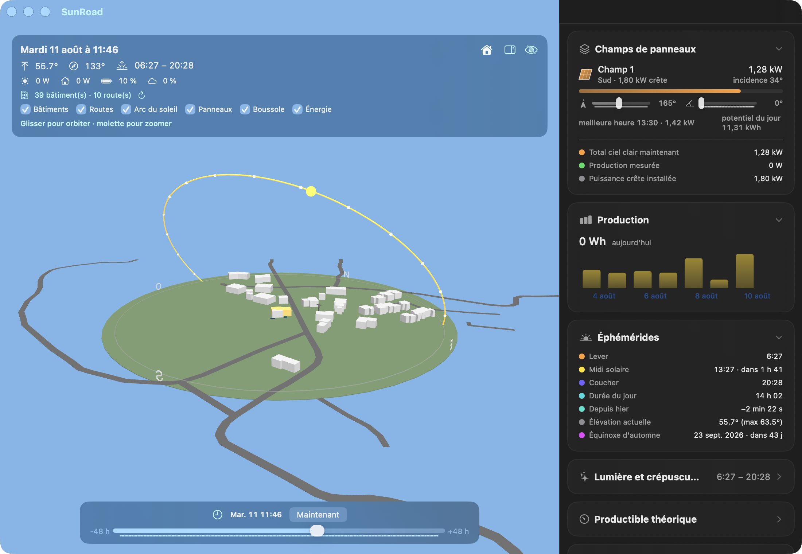

# The SunRoad window (3D)

*New in 2.0.*

SunRoad puts **your house, your neighborhood and the sun in a real 3D scene** — inspired by the [Helios](https://github.com/ReikanYsora/helios) Home Assistant card, but in native 3D: the sun is an actual light source, and the cast shadows are real.

Open it with the **orange sun** in the panel header. Since 2.0, SunRoad **replaces the former Sun window**: the sky dome and solar compass give way to the 3D scene, and everything else (ephemerides, theoretical output, weather, orientation sliders) lives in a collapsible **sidebar**. Location and panel arrays are configured in *Settings → Sun*.

## The scene

- **The neighborhood**: building footprints (120 m radius) and roads (170 m) come from OpenStreetMap — real heights when the map knows them, road widths from their class (residential street, primary road, footpath…). **Your house is detected automatically** (the footprint closest to the configured position) and highlighted in amber. Everything is cached: one download, ↻ button to refresh.
- **The sun, for real**: the day's arc (NOAA ephemerides computed locally) with a marker at every full hour, and the sun as a **directional light** — the neighbors' shadows sweep across the scene through the day, and you can see whether they reach your panels.
- **Your panel arrays**: placed with their real azimuth and tilt, sized from their peak power.
- **A living sky**: night, dawn, daylight, dusk — plus the **real weather** (Open-Meteo): cloud cover veils the light and grays the sky.

## Live energy

**Animated beads** show the flows at the pace of the measured watts: panels → house (yellow), grid pylon → house (orange), house ↔ battery (green charging, orange discharging). Along the arc, two **ribbons** draw your day: **production** in teal and **home consumption** in orange, set slightly inward — one bar per quarter hour, exactly where the sun stood, on a shared scale so you can compare at a glance what the house consumes against what the panels produce. Consumption comes from the Smart CT (whole-home total) when it responds, from the SolarFlow feed-in otherwise.

## ±48 h timeline

The slider at the bottom moves time up to two days backward or forward: sun, shadows, sky and arc follow. The **Now** button returns to real time (the scene then follows the clock, minute by minute).

## The sidebar (inherited from the Sun window)

To the right of the scene, collapsible cards:

- **Panel arrays** — each array with its **azimuth and tilt sliders**: the panel pivots in the 3D scene as you drag, and incidence, theoretical output and best hour follow.
- **Production** — today's total and the **14-day histogram**.
- **Ephemerides** and **Light & twilights** — sunrise/sunset, solar noon, day length, dawns and dusks, golden hours, next solstice or equinox.
- **Theoretical output** — instant and daily clear-sky output, estimated efficiency against the measured production, air mass, shadow length.
- **Local weather** — conditions, cloud cover and the cloud-adjusted output.

The sidebar button in the HUD hides the whole panel for a full-bleed scene.

## Defining your house with a click

The scene's center is the configured location — often approximate. The **house** menu in the HUD offers **"Define my house"**: click the right building in the scene and its footprint becomes the exact center — detection, projection and ephemerides recalibrate on it (and the neighborhood reloads around it). "Back to the settings location" undoes it at any time.

## Layers and wall mode

Every layer toggles on demand (checkboxes): buildings, roads, sun arc, panels, compass, energy. The **crossed-eye** button hides the info banner overlaid on the scene (the sidebar cards stay) — a discreet eye brings it back.

## Good to know

- Neighborhood fidelity depends on OpenStreetMap: without a height tag, a building defaults to 6 m.
- Without network (or if Overpass is busy), the scene stays usable with a stylized house; the neighborhood comes back on the next load.
- Drag to orbit, scroll to zoom.

---

[← The History window](history.md) | [Index](../README.md) | [Widgets →](widgets.md)
