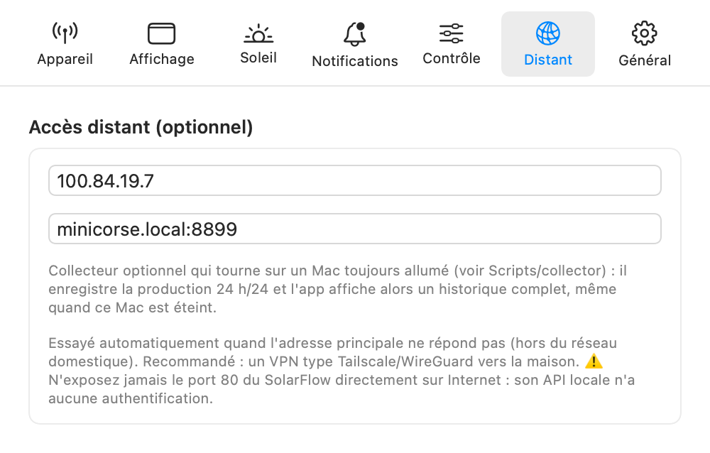

[🇬🇧 English version](../en/remote-access.md)

# Accès distant (hors de la maison)

L'API locale du SolarFlow n'existe que sur votre réseau domestique, et elle n'a **aucune authentification**.

> ⚠️ **N'exposez jamais le port 80 du SolarFlow directement sur Internet** (pas de redirection de port sur la box) : n'importe qui pourrait lire l'état de la batterie et lui envoyer des commandes. Le schéma sûr est un VPN vers la maison.

## Le schéma recommandé : VPN Tailscale ou WireGuard

1. Installez [Tailscale](https://tailscale.com) (ou WireGuard) sur une machine qui reste à la maison — un Mac, un NAS, un Raspberry Pi ou le routeur — et activez le **subnet routing** pour votre réseau local (par exemple `192.168.68.0/24`).
2. Installez Tailscale sur votre Mac. En déplacement, l'IP locale du SolarFlow reste joignable à travers le tunnel.
3. Dans **Réglages → Distant**, renseignez cette adresse comme **hôte de secours** (par exemple l'IP LAN de la batterie routée par le subnet router, ou une IP Tailscale `100.x.y.z` si vous exposez l'appareil autrement).

*L'onglet Distant : hôte de secours et serveur d'historique 24/7.*

## Comment l'hôte de secours est utilisé

- L'application interroge d'abord l'**adresse principale** (locale). Si elle ne répond pas, elle bascule automatiquement sur l'hôte de secours — le panneau l'indique par « Connecté via l'hôte de secours » et le tableau de bord affiche « Connexion : hôte de secours ».
- Une fois basculée, l'application **reste** sur l'hôte de secours et ne reteste l'adresse principale que **toutes les 2 minutes** : les rafraîchissements ne payent pas un délai d'attente à chaque interrogation quand vous êtes loin de chez vous.

## Limite : les noms `.local` ne traversent pas le tunnel

Les noms Bonjour/mDNS (`Zendure-….local`) ne se résolvent que sur le réseau local : **à travers un VPN, utilisez l'adresse IP** de la batterie, pas son nom `.local`. C'est aussi pour cela que l'hôte de secours se renseigne généralement en IP. Une réservation DHCP sur la box garantit que cette IP ne change pas.

## Le collecteur 24/7 (optionnel)

L'énergie du jour et l'historique sont normalement accumulés par l'application : si le Mac est éteint ou en veille, ces heures manquent. Pour un historique complet, un petit **collecteur** (dossier `Scripts/collector` du projet) peut tourner sur une machine toujours allumée :

- un script Python (bibliothèque standard uniquement, Python 3.9+) lancé en LaunchAgent, qui interroge la batterie en continu, intègre l'énergie quotidienne dans une base SQLite et sert une petite API JSON (port 8899 par défaut) ;
- dans **Réglages → Distant**, renseignez **Serveur d'historique 24/7** au format `hôte:port` (par exemple `minicorse.local:8899`) ;
- l'application affiche alors l'historique du collecteur (badge vert « collecteur 24/7 » sur la carte Historique du tableau de bord) et garde le meilleur des deux comptages pour chaque jour.

---

[← Alertes et économies](alertes.md) | [Index](../README.md) | [FAQ et dépannage →](faq.md)
