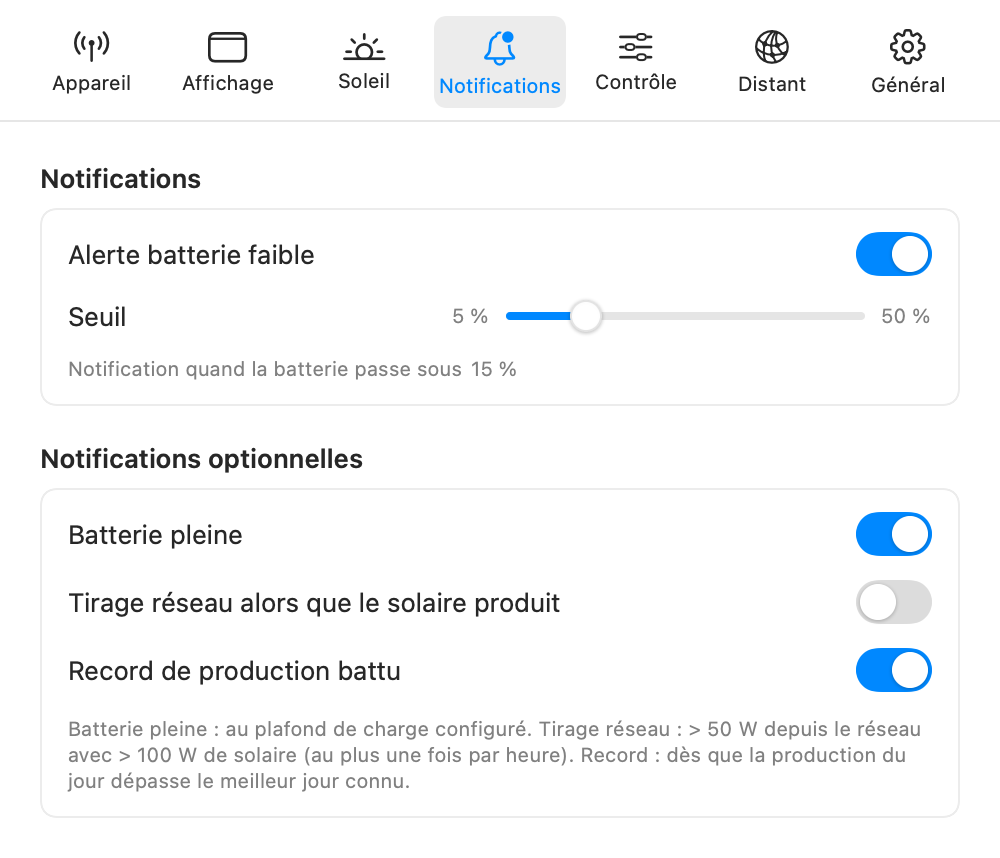

[🇬🇧 English version](../en/alerts.md)

# Alertes et économies

## Alerte batterie faible

Dans **Réglages → Notifications**, l'**alerte batterie faible** (activée par défaut) envoie une notification macOS quand le niveau de charge passe sous un seuil réglable de **5 à 50 %** par pas de 5 (15 % par défaut). L'alerte ne se répète pas en boucle : elle se réarme quand la batterie remonte au moins 5 points au-dessus du seuil.

*L'onglet Notifications : alerte batterie faible et notifications optionnelles.*

## Notifications optionnelles

Trois notifications supplémentaires, désactivées par défaut (opt-in) :

- **Batterie pleine** — quand le niveau atteint le plafond de charge configuré sur l'appareil (la borne haute de la plage SOC) ;
- **Tirage réseau alors que le solaire produit** — quand le SolarFlow tire plus de 50 W du réseau alors que le solaire produit plus de 100 W, signe d'un réglage inattendu ; au plus une notification par heure ;
- **Record de production battu** — dès que la production du jour dépasse le meilleur jour connu de l'historique (il faut au moins quelques jours d'historique pour que la comparaison ait un sens).

À la première activation d'une alerte, macOS demande l'autorisation d'envoyer des notifications. Si elles sont refusées, le panneau l'indique par un bandeau avec un bouton **Autoriser…** qui ouvre les Réglages Système.

## Économies : € et CO₂

Dans **Réglages → Général**, section **Économies** :

- **Prix du kWh (€)** — 0,20 € par défaut ;
- **Facteur CO₂ (g/kWh)** — 55 g par défaut (ordre de grandeur du mix électrique français ; adaptez-le à votre pays).

Ces deux paramètres alimentent l'**Économie du jour** (carte Production du tableau de bord) et l'estimation cumulée sur 14 jours « **≈ X € · Y kg CO₂ évités** » (carte Historique du tableau de bord).

---

[← Contrôle de la batterie](controle.md) | [Index](../README.md) | [Accès distant →](acces-distant.md)
