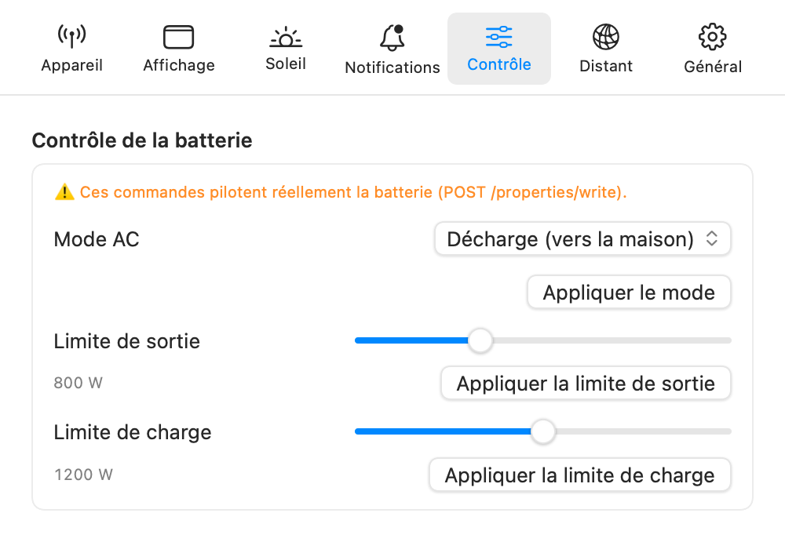

[🇬🇧 English version](../en/control.md)

# Contrôle de la batterie

L'onglet **Réglages → Contrôle** permet de piloter quelques réglages du SolarFlow directement depuis le Mac.

> ⚠️ **Ces commandes agissent réellement sur la batterie.** Elles sont envoyées à l'appareil via son API locale (`POST /properties/write`), exactement comme le ferait l'application Zendure. Modifiez ces réglages en connaissance de cause.

*L'onglet Contrôle : mode AC et limites de charge/sortie.*

## Mode AC

Deux modes, à valider avec **Appliquer le mode** :

- **Charge (depuis le secteur)** — la batterie se charge depuis le réseau électrique (utile en heures creuses) ;
- **Décharge (vers la maison)** — la batterie alimente la maison (le fonctionnement solaire habituel).

## Limites de puissance

- **Limite de sortie** — plafond de la puissance délivrée par la batterie, réglable de 0 à 2400 W par pas de 50 W ;
- **Limite de charge** — plafond de la puissance de charge, réglable de 0 à 2400 W par pas de 100 W.

Chaque curseur a son bouton **Appliquer**. Les curseurs sont pré-remplis avec les valeurs actuelles de l'appareil à l'ouverture de l'onglet.

## Garde-fous

- Appliquer une limite à **0 W coupe complètement ce flux** (plus de sortie, ou plus de charge) : l'application demande une confirmation explicite avant d'envoyer la commande.
- Après chaque envoi, les boutons restent inactifs 2 secondes pour éviter un double envoi.
- Les commandes sont désactivées tant que l'application n'a pas de connexion à la batterie. Elles partent vers l'hôte actif du moment (le local, ou l'hôte de secours si vous êtes à distance).

En dehors de cet onglet, l'application est strictement **en lecture seule** : la supervision n'écrit jamais rien sur la batterie.

---

[← Les widgets](widgets.md) | [Index](../README.md) | [Alertes et économies →](alertes.md)
