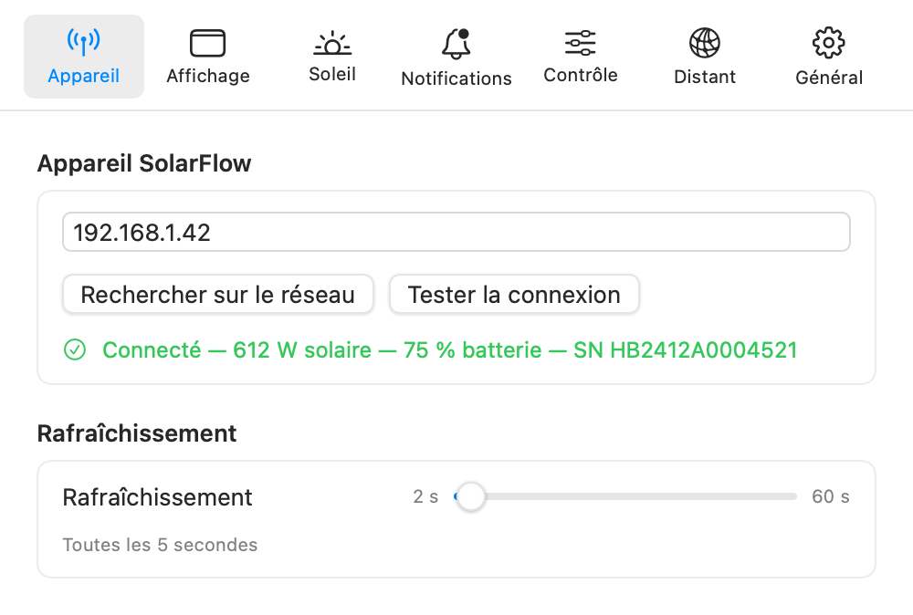

[🇬🇧 English version](../en/getting-started.md)

# Premiers pas

Au premier lancement, la barre de menu affiche `☀️ — W` : l'application ne connaît pas encore l'adresse de votre SolarFlow. La configuration prend une minute.

## Trouver le SolarFlow sur le réseau

1. Cliquez sur l'icône ☀️ puis sur l'engrenage (**Réglages**), onglet **Appareil**.
2. Cliquez sur **Rechercher sur le réseau**. L'application parcourt le réseau en Bonjour/mDNS et liste les appareils Zendure trouvés (nom du type `Zendure-solarFlow2400Pro-…`).
3. Cliquez sur **Utiliser** à côté de l'appareil trouvé, puis sur **Tester la connexion**. En cas de succès, la ligne verte affiche « Connecté », la production actuelle, le niveau de batterie et le numéro de série.

*L'onglet Appareil : recherche réseau, test de connexion et intervalle de rafraîchissement.*

### Saisie manuelle

Si vous connaissez l'adresse de la batterie, tapez-la directement dans le champ **Adresse IP ou nom d'hôte** : une IP (`192.168.1.xx`) ou un nom Bonjour (`Zendure-….local`). Une IP fixe (réservation DHCP sur votre box) est recommandée pour la stabilité.

### La recherche ne trouve rien ?

- Vérifiez que le Mac et le SolarFlow sont sur le **même réseau** (attention aux réseaux invités et à l'isolation Wi-Fi).
- L'API locale est peut-être désactivée sur votre unité. Dans l'application mobile Zendure, ajoutez une intégration **HEMS** puis quittez-la : c'est la méthode documentée pour activer durablement l'API locale.

## L'autorisation « réseau local » de macOS

macOS protège l'accès au réseau local : Zendure Monitor doit être autorisé dans **Réglages Système → Confidentialité et sécurité → Réseau local**. L'application vérifie cette autorisation et affiche un bandeau orange « Accès au réseau local bloqué ? » dans le panneau quand les échecs de connexion y ressemblent, avec un bouton **Ouvrir les réglages…** et un bouton **Réessayer**.

Si le blocage persiste après avoir désactivé puis réactivé l'interrupteur, redémarrez le Mac. Le cas particulier de l'autorisation perdue après une **mise à jour de l'application** est traité dans la [FAQ](faq.md#lautorisation-réseau-local-a-disparu-après-une-mise-à-jour).

> À savoir : cette autorisation ne s'applique pas aux interfaces VPN. Si la batterie répond via Tailscale mais pas en Wi-Fi local, c'est probablement elle la cause.

## Intervalle de rafraîchissement

Toujours dans l'onglet **Appareil**, le curseur **Rafraîchissement** règle la fréquence d'interrogation de la batterie, de **2 à 60 secondes** (5 s par défaut). Chaque interrogation ne transfère qu'environ 2 Ko de JSON : la valeur par défaut convient à la plupart des usages.

Une fois la connexion établie, la barre de menu affiche la production en direct (par exemple `☀️ 842 W`) et le panneau se remplit. Les options d'affichage de la barre de menu sont décrites dans [Le panneau](panneau.md#options-de-la-barre-de-menu).

---

[← Installation](installation.md) | [Index](../README.md) | [Le panneau →](panneau.md)
