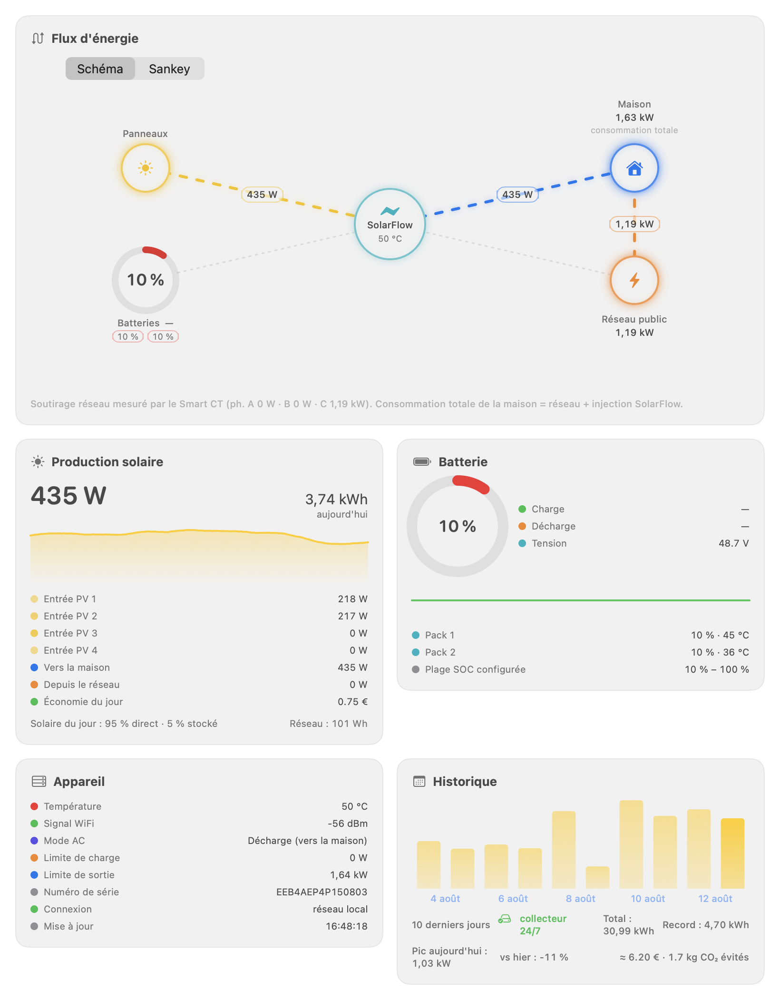

[🇬🇧 English version](../en/dashboard.md)

# La fenêtre Tableau de bord

Ouvrez-la depuis l'icône **jauge bleue** de l'en-tête du panneau, ou d'un double-clic sur n'importe quel graphique du panneau. Tant qu'elle est ouverte, l'application apparaît aussi dans le Dock et dans Cmd-Tab.

*Le tableau de bord : schéma de flux animé en haut, cartes d'indicateurs en dessous.*

## Le flux d'énergie : deux représentations

Un sélecteur en haut de la carte bascule entre **Schéma** et **Sankey**. Ce sont les **mêmes flux et les mêmes valeurs** — seule la lecture change, et votre choix est mémorisé.

### Schéma

Le **SolarFlow est au centre** du schéma ; autour de lui, cinq satellites :

- **Panneaux solaires** — l'entrée photovoltaïque ;
- **Batteries** — avec un anneau du niveau de charge et un lien bidirectionnel (charge ou décharge) ;
- **Réseau public** — l'électricité tirée du secteur ;
- **Maison** — la sortie AC vers votre installation ;
- **Prise hors-réseau** — la sortie de secours du SolarFlow, quand l'appareil la mesure.

Chaque lien ne **s'anime que lorsque l'énergie circule réellement**, dans le vrai sens du flux, avec la puissance affichée en pastille sur le lien. Le schéma montre la **topologie** de votre installation : qui est branché sur quoi.

### Sankey

Ici, c'est la **largeur du ruban qui vaut les watts** : la répartition se lit d'un coup d'œil (quelle part du solaire part vers la maison, quelle part va dans la batterie). Les sources sont à gauche (Réseau, Panneaux, Batteries en décharge), le SolarFlow au centre, les usages à droite (Maison, Batteries en charge, prise hors-réseau).

Deux points de lecture importants :

- **Le bilan du hub ne boucle jamais exactement** (pertes de conversion, bruit de mesure). Un Sankey affirme visuellement que tout ce qui entre ressort : l'écart est donc dessiné en gris, explicitement, sous le nom **« Pertes & conversion »** (il entre plus qu'il ne sort) ou **« Écart de mesure »** (l'inverse) — jamais absorbé en silence.
- **Sans Smart CT**, le soutirage direct de la maison sur le réseau existe mais n'est pas mesuré. Il garde une bande **hachurée d'épaisseur fixe**, hors échelle, marquée « non mesuré », et coiffe de la même façon la barre du nœud Maison : lui donner une largeur reviendrait à inventer une valeur, le supprimer reviendrait à affirmer qu'il vaut zéro.

## Carte Production solaire

La puissance instantanée en très grand, l'énergie du jour, une sparkline, puis le détail : chaque **Entrée PV** (MPPT), **Vers la maison**, **Depuis le réseau**, et l'**Économie du jour** en euros (calculée avec le prix du kWh configuré, voir [Alertes et économies](alertes.md)). En bas, la **répartition solaire du jour** (« X % direct · Y % stocké ») et le cumul tiré du réseau.

## Carte Batterie

- La jauge circulaire du SOC ;
- **Charge** / **Décharge** en watts ;
- La **tension** de la batterie (V) ;
- L'**autonomie estimée** (durée restante annoncée par l'appareil) ;
- Une sparkline du flux batterie ;
- Le détail par **pack** (SOC, température, puissance) ;
- La **plage SOC configurée** (minimum – maximum de charge définis sur l'appareil).

## Carte Appareil

- **Température** de l'appareil (en rouge au-delà de 45 °C) ;
- **Signal WiFi** en dBm (vert à partir de −60 dBm, orange jusqu'à −75 dBm, rouge en dessous) ;
- **Mode AC** — Charge (depuis le secteur) ou Décharge (vers la maison) ;
- **Limite de charge** et **limite de sortie** actuelles (W) ;
- **Numéro de série** ;
- **Connexion** — réseau local ou hôte de secours ;
- L'heure de la dernière **mise à jour** des données.

## Carte Historique

L'histogramme des 14 derniers jours avec le **total**, le **record** de la période, le **pic** du jour et la comparaison **vs hier**. La ligne du bas estime les économies cumulées : **≈ X € · Y kg CO₂ évités** (paramètres dans Réglages → Général). Quand l'historique provient du [collecteur 24/7](acces-distant.md#le-collecteur-247-optionnel), un badge vert « collecteur 24/7 » l'indique.

---

[← Le panneau](panneau.md) | [Index](../README.md) | [La fenêtre Historique →](historique.md)
