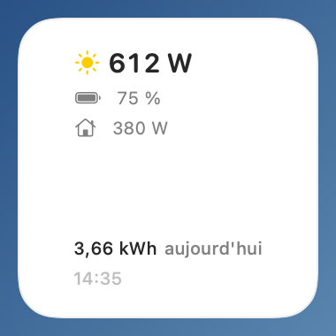
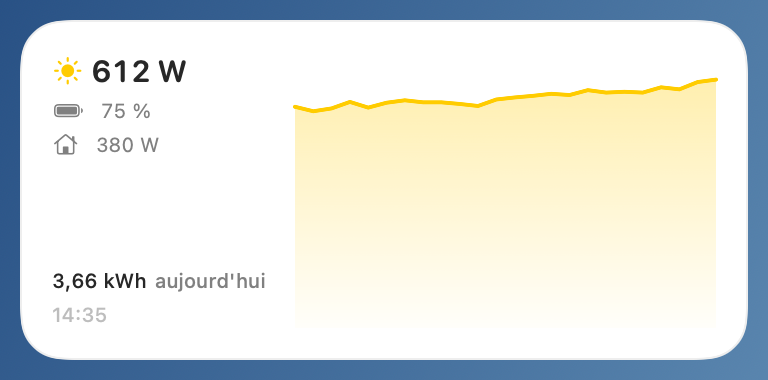
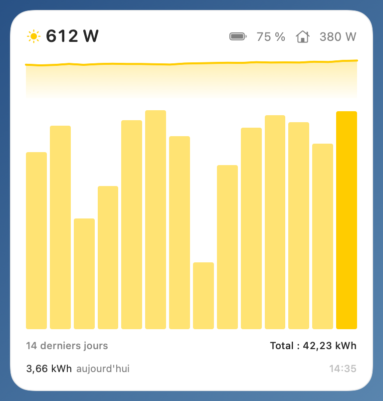

[🇬🇧 English version](../en/widgets.md)

# Les widgets

Zendure Monitor fournit un widget « Production solaire » en **trois tailles**, à poser sur le bureau ou dans le centre de notifications.

## Ajouter un widget

1. Faites un clic droit sur le bureau et choisissez **Modifier les widgets…** (ou ouvrez le centre de notifications et cliquez sur **Modifier les widgets** en bas).
2. Cherchez **Zendure Monitor** dans la liste, choisissez la taille, puis glissez le widget où vous voulez.

Si le widget affiche « Ouvrez Zendure Monitor », lancez l'application une première fois : c'est elle qui alimente le widget en données.

## Les trois tailles

*Petit : production instantanée, batterie, maison et énergie du jour.*

*Moyen : les mêmes informations, plus une mini-courbe de la production récente.*

*Grand : en plus, l'histogramme des 14 derniers jours — la barre du jour en plein, les précédentes atténuées — avec le total de la période.*

Contenu commun aux trois tailles : la **production solaire** instantanée (W), le **niveau de batterie** (%, en rouge à 15 % ou moins), la puissance **envoyée à la maison** (W), l'**énergie produite aujourd'hui** et l'heure du relevé.

## Fraîcheur des données

Le widget est alimenté par l'application (il ne contacte pas la batterie lui-même) :

- tant que l'application tourne, le widget est rafraîchi régulièrement par macOS ;
- si les données ont **plus de 15 minutes** (application fermée, Mac sorti de veille…), le widget se **grise** et affiche l'ancienneté du relevé avec une horloge orange, plutôt que de faire croire à du temps réel.

Si le widget semble bloqué, voir la [FAQ](faq.md#le-widget-ne-se-met-pas-à-jour).

---

[← La fenêtre Soleil](soleil.md) | [Index](../README.md) | [Contrôle de la batterie →](controle.md)
